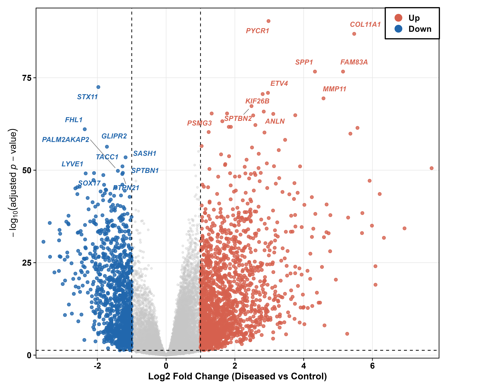
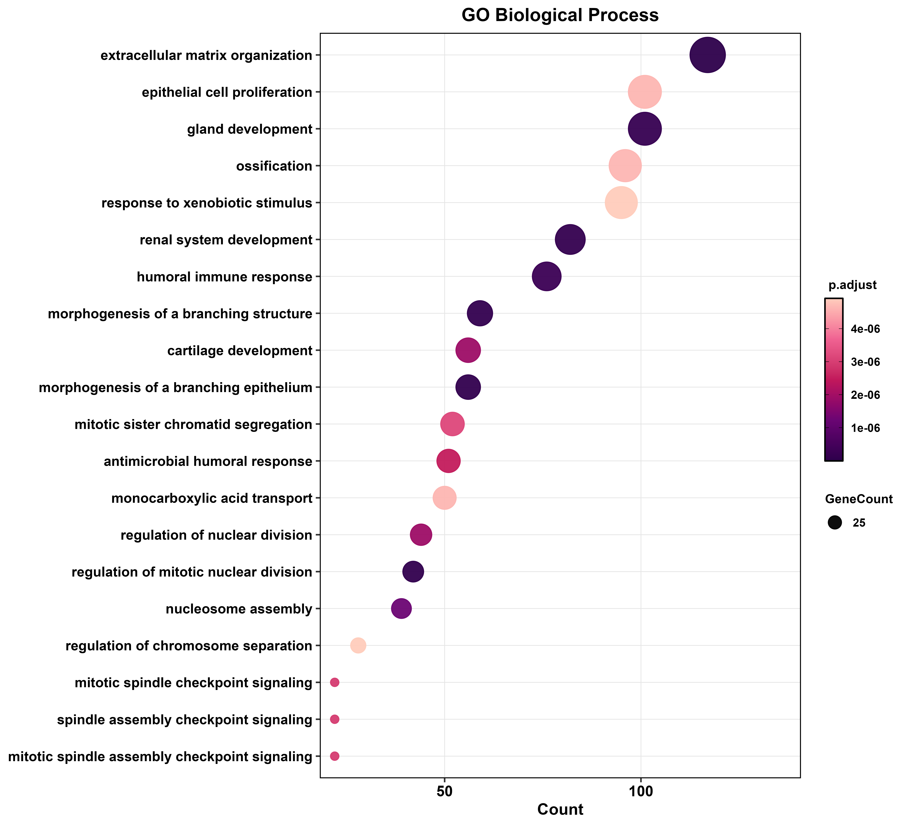
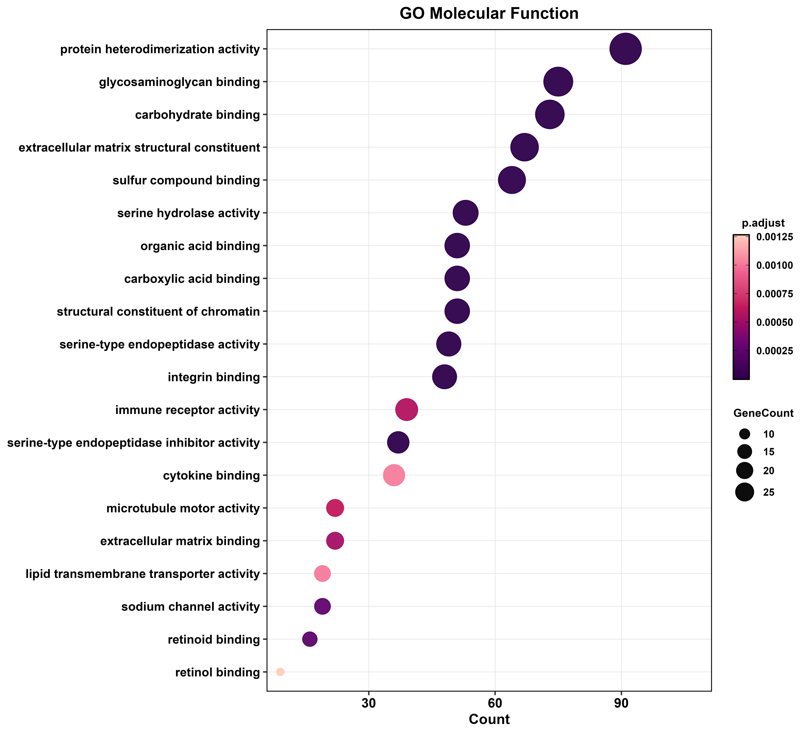
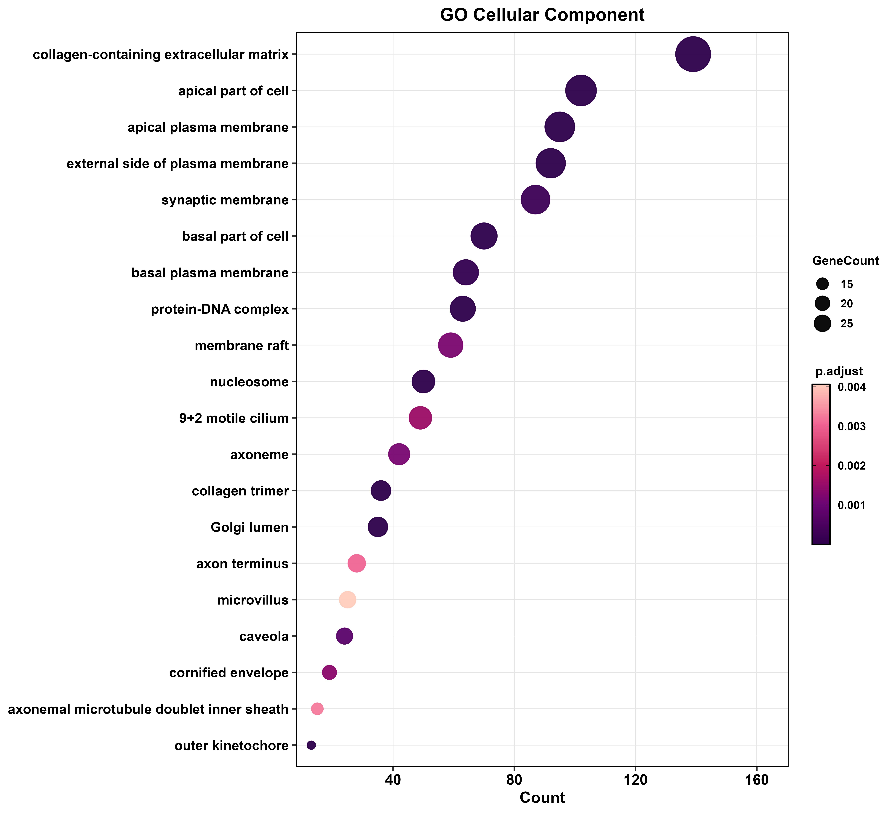
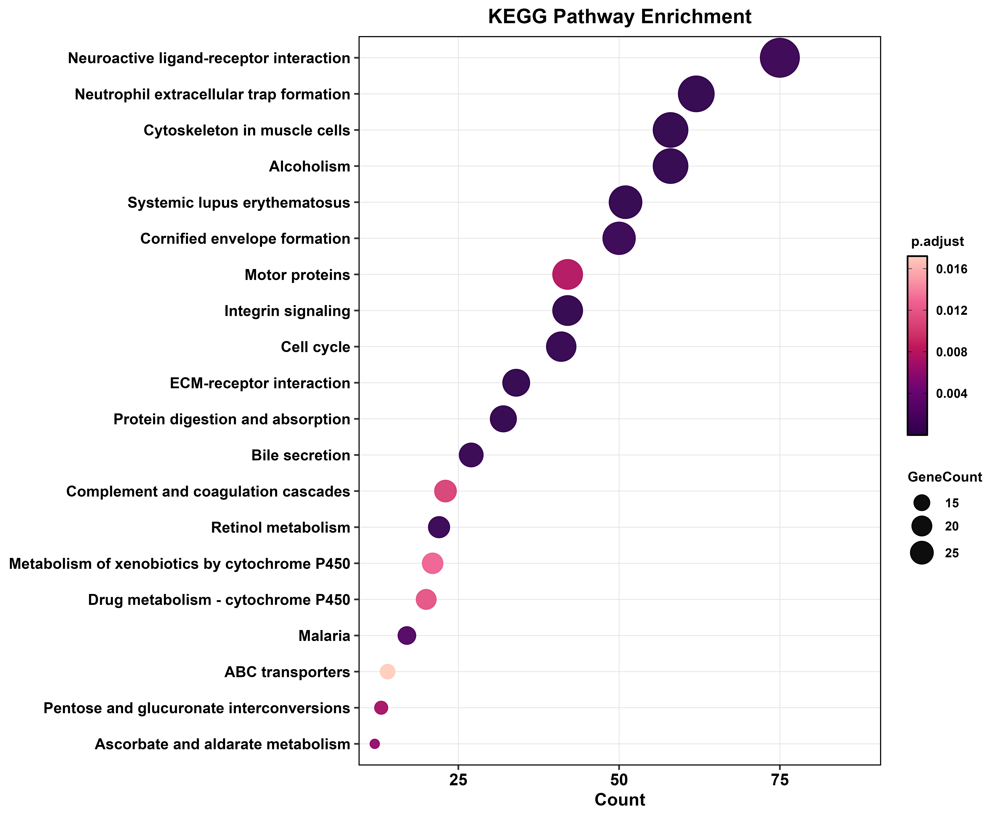

# A Unified Computational Framework for Bulk RNA-seq Meta-Analysis in Lung Cancer

[](https://www.r-project.org/)
[](https://bioconductor.org/packages/DESeq2/)
[-8A2BE2.svg)](https://bioconductor.org/packages/sva/)
[](https://bioconductor.org/packages/org.Hs.eg.db/)
[](https://bioconductor.org/packages/clusterProfiler/)
[](https://bioconductor.org/packages/enrichplot/)
[](https://bioconductor.org/packages/ComplexHeatmap/)
[](https://bioconductor.org/packages/BiocParallel/)
[](https://cran.r-project.org/package=tidyverse)
[](https://cran.r-project.org/package=data.table)
[](https://cran.r-project.org/package=circlize)
[](https://cran.r-project.org/package=RColorBrewer)
[](https://cran.r-project.org/package=ggrepel)
[](https://cran.r-project.org/package=scales)
[](https://cran.r-project.org/package=patchwork)
[](https://cran.r-project.org/package=ggplotify)
[](https://cran.r-project.org/package=svglite)
[](https://opensource.org/licenses/MIT)

## Project Overview

This repository contains a comprehensive and highly rigorous computational pipeline designed for the transcriptomic evaluation of **Lung Cancer (LUAD/LUSC)**. Lung cancer remains one of the most lethal malignancies worldwide, characterized by complex molecular heterogeneity, late-stage diagnosis, and diverse histological subtypes including Lung Adenocarcinoma (LUAD) and Lung Squamous Cell Carcinoma (LUSC).

A major challenge in transcriptomic meta-analyses is the limited statistical power of individual studies and the technical batch effects that arise when combining datasets across different sequencing platforms or institutions. By systematically integrating three independent bulk RNA-seq datasets sourced from the **NCBI Gene Expression Omnibus (GEO)**, this project aims to identify robust, high-confidence transcriptomic signatures associated with lung cancer tumorigenesis.

* **Main Analysis Script:** [`R_script/lung_bulk_rnaseq.R`](R_script/lung_bulk_rnaseq.R)

The core of this project relies on a unified R script designed to process raw count matrices, apply negative binomial regression to eliminate cross-study technical batch effects, perform differential expression analysis, and execute comprehensive functional enrichment analysis across Gene Ontology and KEGG pathway databases.

---

## Datasets Analyzed

To ensure maximum biological consistency and statistical power, this study integrates a curated multi-cohort comprising samples from **three independent GEO studies**, spanning primary lung tumor and matched/unmatched normal adjacent tissue.

| GEO Accession | Sequencing Platform | Samples Included | Notes |
|---|---|---|---|
| **GSE283245** | Illumina NovaSeq 6000 | Tumor + Normal Control | Combined LUAD/LUSC cohort |
| **GSE81089** | Illumina HiSeq 2500 | 19 matched Tumor-Normal pairs | Paired-sample design |
| **GSE159857** | Illumina NextSeq 500 | LUAD + LUSC paired samples | Histological subtype diversity |

* **Merged Count Matrix:** `LUNG_merged_raw_counts.tsv` — Union of all three cohorts after gene intersection and ID harmonization.
* **Combined Metadata:** `LUNG_combined_metadata.csv` — Unified clinical annotation including GEO source, condition (Tumor/Normal), and batch labels.

---

## Analytical Methodology & Core Pipeline

The entire end-to-end computational workflow is executed via a single, highly modular R script located at **`R_script/lung_bulk_rnaseq.R`**.

### 1. Preprocessing & Technical Batch Correction (ComBat-seq)

Raw counts from the three independent GEO cohorts were filtered for common genes across all datasets and merged into a single combined count matrix (`LUNG_merged_raw_counts.tsv`). Cross-study technical variance — introduced by differences in sequencing platform, library preparation, and institutional protocols — was mitigated directly at the raw count level using `ComBat_seq` from the `sva` package.

Unlike standard ComBat, which operates on log-normalized data, ComBat-seq employs a **negative binomial regression model** to adjust batch effects while preserving the integer nature of raw RNA-seq counts, maintaining the strict statistical assumptions required by DESeq2 for downstream modeling. Efficacy of batch correction was validated visually via PCA, confirming that post-correction sample clustering is driven by biological condition rather than GEO source.

### 2. Differential Expression Modeling (DESeq2)

Differential Gene Expression (DGE) analysis was performed on the batch-corrected combined count matrix using `DESeq2`, contrasting the primary **Tumor** condition against **Normal** control tissue. Key analytical decisions:

- **Design formula:** `~ batch + condition` to account for residual batch structure
- **Significance thresholds:** `padj < 0.05` and `|log2FoldChange| > 1`
- **Biotype filtering:** Custom regex matching was applied to remove non-informative non-coding elements (LOC genes, MIR, snoRNAs, LINC RNAs), isolating functionally relevant **protein-coding targets** for downstream analysis
- **VST normalization:** Variance-stabilizing transformation (`vst()`) was applied for visualization and heatmap generation

### 3. Functional Enrichment Analysis (GO & KEGG)

Significant protein-coding DEGs were subjected to **Over-Representation Analysis (ORA)** across:
- **Gene Ontology:** Biological Process (BP), Cellular Component (CC), Molecular Function (MF)
- **KEGG Pathways**

Enrichment was performed using `clusterProfiler` with gene ID mapping via `org.Hs.eg.db`. Results were visualized as dot plots using `enrichplot`, exported in both PNG (repository) and TIFF (publication-grade) formats.

---

## Visualizations

### Quality Control: PCA Before vs. After ComBat-seq Batch Correction

The PCA 2×2 panel validates the efficacy of ComBat-seq batch correction. Post-correction, the samples cluster according to biological condition (Tumor vs. Normal) rather than their GEO source study, confirming successful removal of technical variance.

<p align="center">
  
</p>

### Differential Expression Landscape

Global transcriptomic shifts in lung cancer are mapped via a **Volcano plot**, highlighting significantly upregulated and downregulated protein-coding genes across the integrated meta-cohort. A hierarchical clustering **Heatmap** displays the normalized expression patterns of the **top 25 upregulated and top 25 downregulated** DEGs.

<p align="center">
  
  
</p>

### Functional Enrichment: GO & KEGG Pathway Analysis

<p align="center">
  
  
</p>
<p align="center">
  
  
</p>

---

## Repository Structure

> **Note:** Raw `.tsv` count matrices, large `.rds` R objects, VST expression matrices, and publication-grade uncompressed `.tiff` files are excluded from version control via `.gitignore` due to GitHub's 100 MB file size limit.

---

## Requirements

### R Version
R ≥ 4.0.0

### Bioconductor Packages
```r
BiocManager::install(c(
  "DESeq2", "sva", "clusterProfiler", "enrichplot",
  "ComplexHeatmap", "org.Hs.eg.db", "BiocParallel"
))
```

### CRAN Packages
```r
install.packages(c(
  "tidyverse", "data.table", "ggrepel", "circlize",
  "RColorBrewer", "scales", "patchwork", "ggplotify", "svglite"
))
```

---

## Key Findings Summary

| Metric | Value |
|---|---|
| Total genes tested | See `DESeq2_all_genes_with_symbols.csv` |
| Significant DEGs (padj < 0.05, \|LFC\| > 1) | See `DESeq2_significant_DEGs_all.csv` |
| Protein-coding DEGs retained | See `DESeq2_significant_DEGs_proteinCoding.csv` |
| GO BP terms enriched | See `GO_BP_LUNG.csv` |
| KEGG pathways enriched | See `KEGG_LUNG.csv` |
| Datasets integrated | 3 (GSE283245, GSE81089, GSE159857) |
| Batch correction method | ComBat-seq (negative binomial regression) |

---

## License

This project is licensed under the **MIT License** — see the [LICENSE](LICENSE) file for details.

